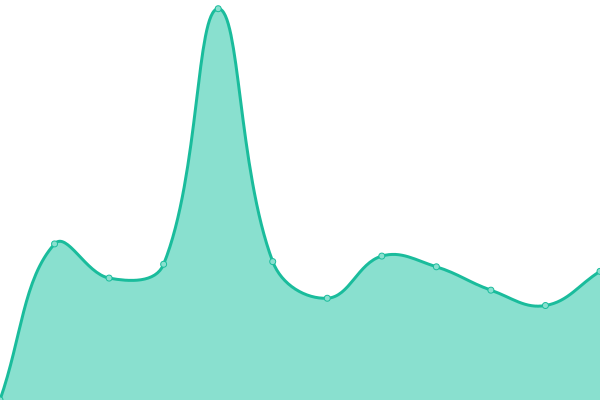

# [📈 Live Status](https://Plyer.github.io/upptime): <!--live status--> **🟧 Partial outage**

This repository contains the open-source uptime monitor and status page for [Plyer](https://Plyer.github.io/upptime), powered by [Upptime](https://github.com/upptime/upptime).

With [Upptime](https://upptime.js.org), you can get your own unlimited and free uptime monitor and status page, powered entirely by a GitHub repository. We use [Issues](https://github.com/Plyer/upptime/issues) as incident reports, [Actions](https://github.com/Plyer/upptime/actions) as uptime monitors, and [Pages](https://Plyer.github.io/upptime) for the status page.

<!--start: status pages-->
<!-- This summary is generated by Upptime (https://github.com/upptime/upptime) -->
<!-- Do not edit this manually, your changes will be overwritten -->
<!-- prettier-ignore -->
| URL | Status | History | Response Time | Uptime |
| --- | ------ | ------- | ------------- | ------ |
|  [xiaoya](https://xiaoya.flyago.cn) | 🟩 Up | [xiaoya.yml](https://github.com/Plyer/upptime/commits/HEAD/history/xiaoya.yml) | 

 1846ms
     
 | 

<a href="https://Plyer.github.io/upptime/history/xiaoya">98.89%</a>
    

|  [freshrss](https://freshrss.flyago.cn) | 🟩 Up | [freshrss.yml](https://github.com/Plyer/upptime/commits/HEAD/history/freshrss.yml) | 

 1753ms
     
 | 

<a href="https://Plyer.github.io/upptime/history/freshrss">98.77%</a>
    

|  [halo](https://blog.flyago.cn) | 🟥 Down | [halo.yml](https://github.com/Plyer/upptime/commits/HEAD/history/halo.yml) | 

 1406ms
     
 | 

<a href="https://Plyer.github.io/upptime/history/halo">20.10%</a>
    

|  [RSSHub](https://rsshub.flyago.cn) | 🟥 Down | [rss-hub.yml](https://github.com/Plyer/upptime/commits/HEAD/history/rss-hub.yml) | 

 1723ms
     
 | 

<a href="https://Plyer.github.io/upptime/history/rss-hub">98.77%</a>
    

|  [teslamate](https://flyago.cn/site.webmanifest) | 🟩 Up | [teslamate.yml](https://github.com/Plyer/upptime/commits/HEAD/history/teslamate.yml) | 

 1397ms
     
 | 

<a href="https://Plyer.github.io/upptime/history/teslamate">98.65%</a>
    

<!--end: status pages-->

[**Visit our status website →**](https://Plyer.github.io/upptime)

## 📄 License

- Powered by: [Upptime](https://github.com/upptime/upptime)
- Code: [MIT](./LICENSE) © [Anand Chowdhary](https://anandchowdhary.com), supported by [Pabio](https://pabio.com)
- Data in the `./history` directory: [Open Database License](https://opendatacommons.org/licenses/odbl/1-0/)
